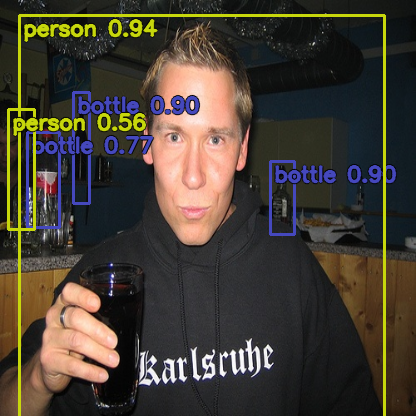

# Detection_YOLOv3
YOLOv3 방식으로 Pytorch framework 사용하여 object detection을 진행하는 프로젝트 입니다.

## Implementations

- YOLOv3
- YOLO_Loss (CIoU, DIoU, GIoU)
- Data(Prepare)
- Data Augmentations(Albumentations)
- Muti GPU Training

## 프로젝트 구조
```
Detection_YOLOv3
├─ .gitignore
├─ __README.md
├─ configs # 학습 시 사용할 하이퍼 파라미터, 데이터셋 설정 등 Configuration을 위한 yaml 파일 경로
├─ dataset # Image Data Generator 모듈
├─ models # Detector, Convolution Module 등 구현
│  ├─ backbone
│  ├─ detector
│  ├─ layers
│  └─ loss
├─ module # 학습을 위한 Pytorch Lightning 모듈
├─ onnx_module # onnx 변형을 위한 모듈
├─ train_detector.py # Detector 학습 스크립트
└─ utils

```

## Requirements
`requirements.txt` 파일을 참고하여 Anaconda 환경 설정 (conda install 명령어)  
`PyYaml`  
`PyTorch`  
`Pytorch Lightning`

## Config Train Parameters

기본 설정값은 ./configs/default_settings.yaml에 정의됩니다.  
Train 스크립트 실행 시 입력되는 CFG 파일로 하이퍼파라미터 및 학습 기법을 설정할 수 있습니다.

[default_settings.yaml](./configs/default_settings.yaml)

    // ./configs/*.yaml 파일 수정
    // ex) cls_frostnet -> default_settings 파라미터를 업데이트 해서 사용
    model : 'DarkNet53'
    dataset_name : Poscal_VOC
    classes : 20
    epochs: 500
    data_path : '/mnt/det_train/'
    save_dir : './saved'
    workers: 8
    ...

## Train Detector

Object Detector 모델 Train 스크립트 입니다.

    python train_detector.py --cfg configs/det_darknet53.yaml

## Test YOLOv3


## TODOs
- Backbone Networks Customizing
- Deployment를 위한 ONNX Conversion Script, Torch Script 추가
- mAP Callback method 추가
- QAT, Grad Clip, SWA, FP16 등 학습 기법 추가 및 테스트
- YOLOv4 version upgrade